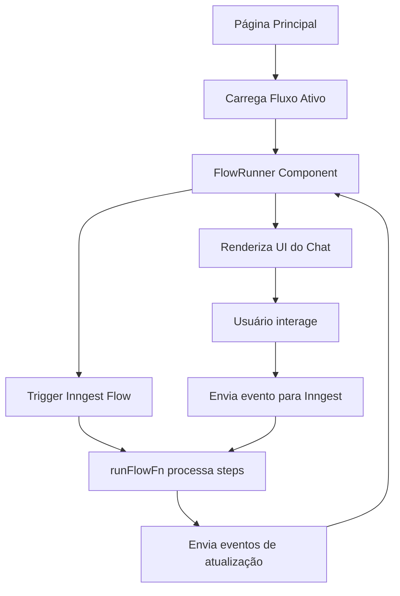

# Guia do Sistema de Fluxos com Inngest

## Visão Geral

O sistema de fluxos foi refatorado para usar Inngest, tornando-o mais robusto e estruturado. O Inngest é uma plataforma de orquestração de funções que permite criar fluxos de trabalho complexos de forma confiável.

## Componentes Principais

### 1. **Flow Types** (`/app/src/inngest/functions/flow-steps.ts`)
Define os tipos de steps disponíveis:
- **TextStep**: Exibe mensagem de texto com delay opcional
- **ButtonStep**: Apresenta opções clicáveis ao usuário
- **InputStep**: Solicita entrada de texto do usuário

### 2. **Flow Runner Function** (`runFlowFn`)
Função principal do Inngest que orquestra a execução do fluxo:
- Processa steps em sequência
- Aguarda interações do usuário
- Envia atualizações para o cliente
- Armazena respostas

### 3. **FlowRunner Component** (`/components/FlowRunner.tsx`)
Componente React que renderiza o fluxo na interface:
- Carrega configuração do fluxo
- Exibe mensagens em formato de chat
- Gerencia interações (botões e inputs)
- Comunica com Inngest via API

### 4. **Config Page** (`/app/config-inngest`)
Interface para configurar fluxos:
- Criar/editar fluxos
- Adicionar e organizar steps
- Definir fluxo MASTER
- Preview em tempo real

## Como Usar

### 1. Criar um Fluxo
1. Acesse `/config-inngest`
2. Clique em "Novo Fluxo"
3. Defina nome e descrição
4. Marque como MASTER se quiser que apareça na tela inicial

### 2. Adicionar Steps
1. Com um fluxo selecionado, clique em "Novo Step"
2. Escolha o tipo:
   - **Texto**: Para mensagens simples
   - **Botões**: Para opções de escolha
   - **Input**: Para coletar informações
3. Configure o conteúdo
4. Salve

### 3. Organizar Steps
- Use as setas ⬆️⬇️ para reordenar
- Steps são executados em sequência
- Edite ou delete conforme necessário

### 4. Testar
- O fluxo aparece automaticamente na tela inicial se for MASTER
- Ou pode ser testado diretamente no preview

## Fluxo de Dados



## APIs

### `/api/fluxo-ativo`
Retorna o fluxo MASTER ou o mais recente ativo

### `/api/inngest-trigger`
Dispara eventos para o Inngest:
- `flow/start`: Inicia execução do fluxo
- `flow/button.selected`: Usuário selecionou botão
- `flow/input.submitted`: Usuário enviou input

### `/api/fluxos` e `/api/steps`
CRUD para fluxos e steps (compatível com sistema anterior)

## Exemplo de Fluxo

```json
{
  "name": "Onboarding Livro",
  "steps": [
    {
      "type": "text",
      "content": "Olá! Vou te ajudar a criar seu livro.",
      "delay": 500
    },
    {
      "type": "text",
      "content": "Primeiro, preciso saber sobre o que você quer escrever.",
      "delay": 700
    },
    {
      "type": "input",
      "placeholder": "Digite o tema do seu livro...",
      "variable": "tema_livro"
    },
    {
      "type": "text",
      "content": "Ótimo! Agora escolha o tipo de livro:",
      "delay": 500
    },
    {
      "type": "button",
      "buttons": [
        { "id": "1", "label": "Ficção", "value": "fiction" },
        { "id": "2", "label": "Não-ficção", "value": "non-fiction" },
        { "id": "3", "label": "Técnico", "value": "technical" }
      ]
    }
  ]
}
```

## Vantagens do Inngest

1. **Confiabilidade**: Retry automático, persistência de estado
2. **Observabilidade**: Dashboard para monitorar execuções
3. **Escalabilidade**: Processa fluxos de forma assíncrona
4. **Flexibilidade**: Fácil adicionar novos tipos de steps

## Próximos Passos

- Adicionar steps condicionais
- Integrar com sistema de pagamento
- Adicionar analytics de conversão
- Criar templates de fluxos prontos
